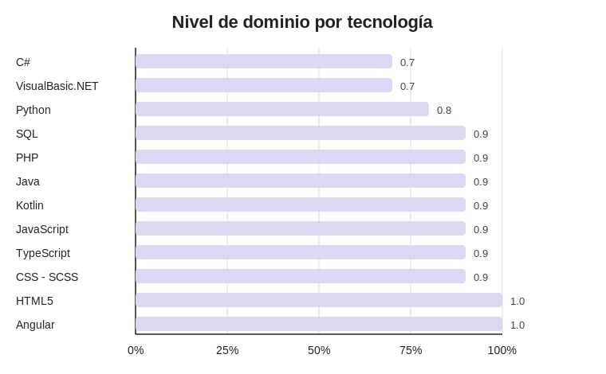

# Introduction

Proactive software developer. Ability to lead or work in a team efficiently. Solid knowledge of Front-End and Back-End development for desktop applications, Android mobile applications and websites. Constantly learning new technologies and work tools.

## Contact

- Phone: +52 272 168 1262
- Email: braulio.hp@outlook.com

## Projects

- **Agenda**: Mobile application for Android developed with Kotlin where users can keep track of their pending tasks.
- **Pokedex**: Cross-platform mobile application developed with Ionic where users can consult the Pokedex using the PokeAPI.
- **Finance[private]**: Deferred payment collections manager for a local enterpreneur.

## Soft Skills

- Cash handling
- Customer Support
- Administrative experience
- Communication skills
- Leadership
- Teamwork

## Technology Proficiency

## Education

- **Institution**: ICEC.
  
    **Date**: 2015 - 2016.
  
    *Degree*: Computer Technician.

- **Institution**: CBTis 142.
  
    **Date**: 2016 - 2019.
  
    *Degree*: Programming Technician.

    
- **Institution**: TecNM. Campus Orizaba.
  
    **Date**: 2019 - 2023.
  
    *Degree*: Computer Systems Engineering.

    
- **Institution**: TecNM. Campus Orizaba.
  
    **Date**: 2019 - 2023.
  
    *Degree:* Master's degree in Computer Systems.
  
    *Status*: Degree administrarive process in progress.

## Certifications

- Android application development with Kotlin.
- Android application development with Java.
- Computer equipment installation and repair technician.
- Introduction to databases.
- Database administrator.
- Data network technician.
- Data curator.
- Finder.
- Diploma in Web Development and Mobile Applications.
- Diploma in Computer Systems Technician.
